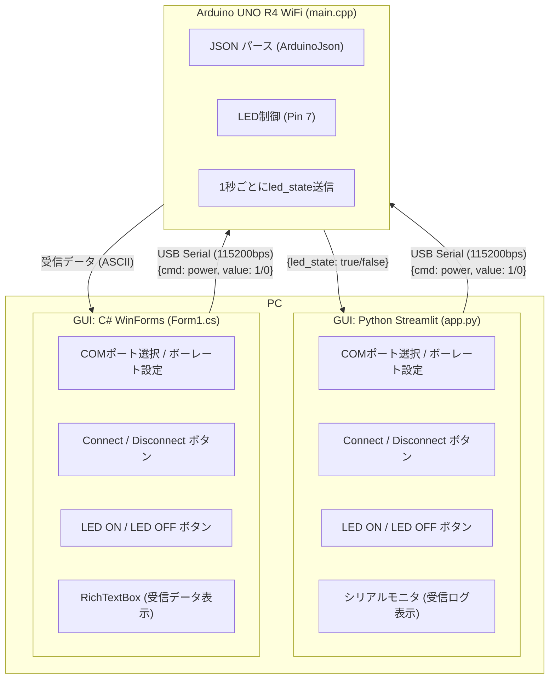

# json_communication_between_arduino_and_gui

ArduinoとPC上のGUI間でJSON形式の通信を行うサンプルプロジェクトです。

## 1. Summary

Arduino UNO R4 WiFi とPC上のGUIをUSBシリアル経由で接続し、**JSON形式のコマンド**をやり取りしてLEDを制御します。

| 方向 | JSON | 説明 |
|------|------|------|
| PC → Arduino | `{"cmd": "power", "value": 1}` | LED ON |
| PC → Arduino | `{"cmd": "power", "value": 0}` | LED OFF |
| Arduino → PC | `{"led_state": true/false}` | 1秒ごとにLED状態を通知 |

### 構成要素

- **Firmware** — PlatformIO (Arduino UNO R4 WiFi)
- **GUI** — 以下の2種類を実装
  - Python + Streamlit（Webブラウザ上で動作）
  - Visual Studio C# WinForms（Windowsネイティブアプリ）

---

## 2. 全体構成図



---

## 3. ディレクトリ構成

```
json_communication_between_arduino_and_gui/
├── Firmware/
│   └── hello_json_led/          # PlatformIO プロジェクト
│       ├── platformio.ini        # ボード設定 (Arduino UNO R4 WiFi, 115200bps)
│       └── src/
│           └── main.cpp          # Arduinoファームウェア本体
└── GUI/
    ├── python_streamlit/         # Python + Streamlit GUI
    │   ├── app.py                # Streamlitアプリ本体
    │   └── requirements.txt      # 依存ライブラリ (streamlit, pyserial)
    └── visual_studio_sharp/      # C# WinForms GUI
        └── test_serial_port_WinFormsApp/
            └── test_serial_port_WinFormsApp/
                ├── Form1.cs      # フォーム本体
                └── Program.cs    # エントリポイント
```

---

## 4. Firmware

### ハードウェア

| 項目 | 内容 |
|------|------|
| ボード | Arduino UNO R4 WiFi |
| 接続ピン | Pin 7 (LED) |
| 通信速度 | 115200 bps |
| COMポート | COM6 (platformio.ini で設定) |

### ライブラリ

- [ArduinoJson](https://arduinojson.org/) v7.4.2+

### ビルド・書き込み

[PlatformIO](https://platformio.org/) を使用します。

```bash
# ビルド
pio run

# 書き込み
pio run --target upload

# シリアルモニタ
pio device monitor
```

### 動作仕様

1. シリアルから1行受信するごとにJSONとして解析
2. `cmd == "power"` のとき `value` に応じてLEDをON/OFF
3. 1秒ごとに現在のLED状態を `{"led_state": true/false}` 形式で送信

---

## 5. GUI

### 5-1. Python + Streamlit

#### 必要環境

- Python 3.10+
- 依存ライブラリ: `streamlit >= 1.30.0`, `pyserial >= 3.5`

#### セットアップ & 起動

```bash
cd GUI/python_streamlit
pip install -r requirements.txt
streamlit run app.py
```

ブラウザが自動的に開き、GUIが表示されます。

#### 機能

| 機能 | 説明 |
|------|------|
| COMポート選択 | 利用可能なポートを自動リストアップ |
| ボーレート選択 | 9600 / 19200 / 38400 / 57600 / **115200** |
| Connect / Disconnect | シリアルポートの開閉 |
| LED ON / LED OFF | `{"cmd": "power", "value": 1/0}` を送信 |
| LED状態表示 | Arduinoから受信した `led_state` をリアルタイム表示 |
| シリアルモニタ | 受信ログをタイムスタンプ付きで表示（最大200行）|
| 自動更新 | 接続中は0.5秒ごとに画面を自動リフレッシュ |

---

### 5-2. Visual Studio C# WinForms

#### 必要環境

- Visual Studio 2022 (または互換バージョン)
- .NET (csproj の TargetFramework に依存)

#### セットアップ & 起動

`GUI/visual_studio_sharp/test_serial_port_WinFormsApp/test_serial_port_WinFormsApp.sln` をVisual Studioで開いてビルド・実行してください。

#### 機能

| 機能 | 説明 |
|------|------|
| COMポート選択 | ドロップダウンを開いた際にポートを自動スキャン |
| ボーレート選択 | コンボボックスで指定 |
| Connect / Disconnect | シリアルポートの開閉 |
| LED ON / LED OFF | `{"cmd": "power", "value": 1/0}` を送信 |
| 受信表示 | `RichTextBox` に受信データをリアルタイム追記 |

---

## 6. JSON 通信プロトコル

```jsonc
// PC → Arduino: LED点灯
{"cmd": "power", "value": 1}

// PC → Arduino: LED消灯
{"cmd": "power", "value": 0}

// Arduino → PC: LED状態通知 (1秒周期)
{"led_state": true}
{"led_state": false}
```

- 各メッセージは **改行 (`\n`) 区切り**
- 文字コード: **UTF-8 / ASCII**

---

## 7. ライセンス

[LICENSE](LICENSE) を参照してください。
