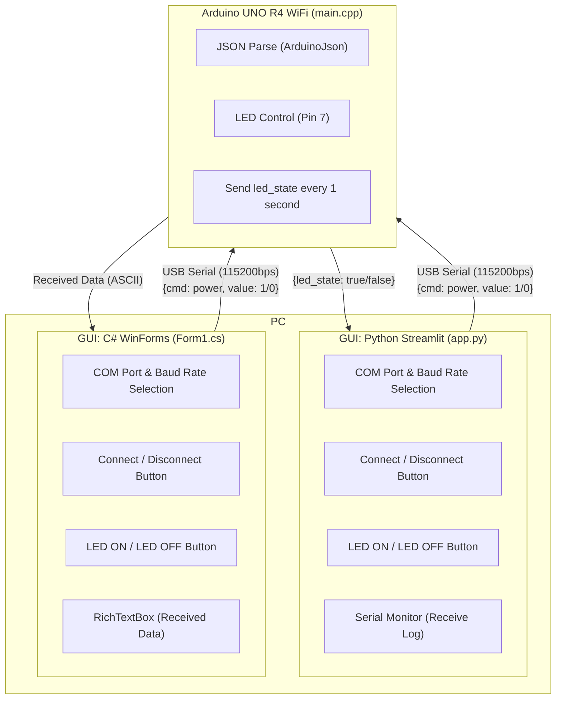

# json_communication_between_arduino_and_gui

A sample project for JSON-based communication between an Arduino and a GUI on a PC.

## 1. Summary

This project connects an **Arduino UNO R4 WiFi** to a PC GUI via USB Serial and controls an LED by exchanging **JSON-formatted commands**.

| Direction | JSON | Description |
|-----------|------|-------------|
| PC → Arduino | `{"cmd": "power", "value": 1}` | Turn LED ON |
| PC → Arduino | `{"cmd": "power", "value": 0}` | Turn LED OFF |
| Arduino → PC | `{"led_state": true/false}` | LED status notification (every 1 second) |

### Components

- **Firmware** — PlatformIO (Arduino UNO R4 WiFi)
- **GUI** — Two implementations available:
  - Python + Streamlit (runs in a web browser)
  - Visual Studio C# WinForms (native Windows application)

---

## 2. System Architecture



---

## 3. Directory Structure

```
json_communication_between_arduino_and_gui/
├── Firmware/
│   └── hello_json_led/          # PlatformIO project
│       ├── platformio.ini        # Board config (Arduino UNO R4 WiFi, 115200bps)
│       └── src/
│           └── main.cpp          # Arduino firmware
└── GUI/
    ├── python_streamlit/         # Python + Streamlit GUI
    │   ├── app.py                # Streamlit application
    │   └── requirements.txt      # Dependencies (streamlit, pyserial)
    └── visual_studio_sharp/      # C# WinForms GUI
        └── test_serial_port_WinFormsApp/
            └── test_serial_port_WinFormsApp/
                ├── Form1.cs      # Main form
                └── Program.cs    # Entry point
```

---

## 4. Firmware

### Hardware

| Item | Details |
|------|---------|
| Board | Arduino UNO R4 WiFi |
| LED Pin | Pin 7 |
| Baud Rate | 115200 bps |
| COM Port | COM6 (configured in platformio.ini) |

### Library

- [ArduinoJson](https://arduinojson.org/) v7.4.2+

### Build & Upload

Uses [PlatformIO](https://platformio.org/).

```bash
# Build
pio run

# Upload
pio run --target upload

# Serial monitor
pio device monitor
```

### Behavior

1. Reads incoming serial data line by line and parses each line as JSON.
2. When `cmd == "power"`, turns the LED ON or OFF according to `value`.
3. Sends the current LED state as `{"led_state": true/false}` every 1 second.

---

## 5. GUI

### 5-1. Python + Streamlit

#### Requirements

- Python 3.10+
- Dependencies: `streamlit >= 1.30.0`, `pyserial >= 3.5`

#### Setup & Launch

```bash
cd GUI/python_streamlit
pip install -r requirements.txt
streamlit run app.py
```

A browser window will open automatically with the GUI.

#### Features

| Feature | Description |
|---------|-------------|
| COM Port Selection | Auto-lists available ports |
| Baud Rate Selection | 9600 / 19200 / 38400 / 57600 / **115200** |
| Connect / Disconnect | Opens/closes the serial port |
| LED ON / LED OFF | Sends `{"cmd": "power", "value": 1/0}` |
| LED Status Display | Shows `led_state` received from Arduino in real time |
| Serial Monitor | Displays receive log with timestamps (up to 200 lines) |
| Auto Refresh | Automatically refreshes the UI every 0.5 seconds while connected |

---

### 5-2. Visual Studio C# WinForms

#### Requirements

- Visual Studio 2022 (or compatible version)
- .NET (depends on TargetFramework in csproj)

#### Setup & Launch

Open the solution file in Visual Studio, then build and run:

```
GUI/visual_studio_sharp/test_serial_port_WinFormsApp/test_serial_port_WinFormsApp.sln
```

#### Features

| Feature | Description |
|---------|-------------|
| COM Port Selection | Scans available ports when the dropdown is opened |
| Baud Rate Selection | Specified via combo box |
| Connect / Disconnect | Opens/closes the serial port |
| LED ON / LED OFF | Sends `{"cmd": "power", "value": 1/0}` |
| Receive Display | Appends received data to a `RichTextBox` in real time |

---

## 6. JSON Communication Protocol

```jsonc
// PC → Arduino: Turn LED ON
{"cmd": "power", "value": 1}

// PC → Arduino: Turn LED OFF
{"cmd": "power", "value": 0}

// Arduino → PC: LED status notification (1-second interval)
{"led_state": true}
{"led_state": false}
```

- Each message is **newline (`\n`) delimited**
- Character encoding: **UTF-8 / ASCII**

---

## 7. License

See [LICENSE](LICENSE) for details.
